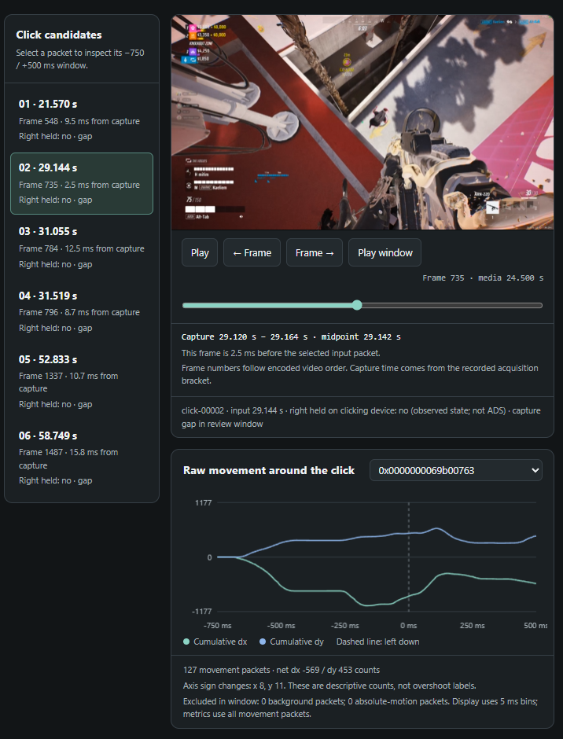

# Game Sensitivity Coach

[](https://github.com/DenisSergeevitch/game-sensitivity-coach/actions/workflows/tests.yml)
[](https://github.com/DenisSergeevitch/game-sensitivity-coach/releases/latest)
[](LICENSE)

An agent skill that discovers your mouse settings, carries a familiar sensitivity into another game, and reviews ordinary gameplay to recommend adjustments. You play; your agent handles recording, image inspection, evidence, and calculations.

Built from practical work with **THE FINALS**, **Battlefield 6**, and **Holdfast**. The workflow is game-independent; capture support, file formats, and each game's sensitivity math still need verification.



*An example from THE FINALS. The agent reviews the frames and input logs itself. This optional viewer lets you inspect its evidence; you do not need to label shots or fill in forms.*

## What it does

| Ask your agent to… | What happens |
| --- | --- |
| Understand your current setup | Find the active profile, read native settings, distinguish hip fire from scoped/ADS values, and record where each value came from. |
| Transfer sensitivity between games | Establish each game's scaling and match a stated metric, such as turn distance. Optical matching is handled separately. |
| Improve aim from gameplay | Record a bounded session, inspect actual frames and mouse movement, distinguish sensitivity problems from timing/recoil/target movement, and propose a setting to retain or test. |

When you authorize a change, the agent prepares an exact patch, backs up the original, applies it with the game closed, and verifies the result. It can then compare another sample and keep or roll back the change within your agreed limits. There is no universal “best” number: retaining a well-supported baseline is a valid verdict.

## Install

[Download the latest skill ZIP](https://github.com/DenisSergeevitch/game-sensitivity-coach/releases/latest/download/game-sensitivity-coach.zip), then extract it. Keep the entire `game-sensitivity-coach` folder together, including `scripts`, `references`, and `assets`. Each [release](https://github.com/DenisSergeevitch/game-sensitivity-coach/releases/latest) also includes a SHA-256 checksum.

| Agent | Personal installation | Project installation |
| --- | --- | --- |
| Codex | `~/.agents/skills/game-sensitivity-coach/` | `.agents/skills/game-sensitivity-coach/` |
| Claude Code | `~/.claude/skills/game-sensitivity-coach/` | `.claude/skills/game-sensitivity-coach/` |
| Another Agent Skills host | Copy the folder into that host's documented skill directory. | The folder containing `SKILL.md` is the skill. |

Alternatively, clone directly into your agent's skill directory. For a personal Codex installation:

```sh
git clone https://github.com/DenisSergeevitch/game-sensitivity-coach.git ~/.agents/skills/game-sensitivity-coach
```

On Windows, `~` means your user home directory. Follow the current [Codex skill documentation](https://learn.chatgpt.com/docs/build-skills) or [Claude Code skill documentation](https://code.claude.com/docs/en/skills) if your host uses a different setup. The package follows the [Agent Skills format](https://agentskills.io/specification); `agents/openai.yaml` supplies optional Codex display metadata.

You need:

- An agent that can run local commands, read files, and inspect images.
- **Python 3.8 or newer**. The bundled scripts use the Python standard library; no Python packages or separate AI API key are required.
- **FFmpeg** for recording video and exporting evidence. Put it on `PATH`, or pass its location with `--ffmpeg`. Use a build with `libx264`, H.264 decoding, and PNG output; see the [FFmpeg download page](https://ffmpeg.org/download.html).
- **Windows on the gaming computer for bundled live capture.** Offline reports, conversion, and file helpers are portable Python. A cloud-only agent needs existing session files or a connection to an authorized local runner; it cannot see your PC's monitor by itself. For WSL, launch the recorder with native Windows Python.

## Start with a message

In Codex, mention `$game-sensitivity-coach`. In Claude Code, invoke `/game-sensitivity-coach`, then describe the task. For example:

> Find my current THE FINALS mouse settings. I will play normally for eight minutes; record that session, inspect my sniper aim, and tell me which sensitivity to keep or test. Handle the analysis yourself.

> Transfer my current THE FINALS sensitivity into Battlefield 6. Find both profiles and explain the exact target value and assumptions. Prepare the patch for me to review.

> Apply the proposed scoped setting after I close the game. Back up the file, then compare another five-minute session. Ask before making any further change.

The agent discovers what it can instead of presenting a setup form. It may need one essential clarification if neither files nor images establish a required fact. A request for a recommendation alone does not authorize a settings change; an explicit application request does.

## How the observation works

At launch, the recorder chooses the monitor most covered by a visible matching game window, unless the agent supplies `--monitor`. It records that selected monitor while the matching game is foreground and receives Windows mouse Raw Input. It saves video, frame acquisition times, mouse counts/buttons, metadata, and an integrity manifest. Capture pauses when that game loses focus; monitor selection does not follow later window moves. Visible overlays and notifications can appear in a full-monitor recording.

The report aligns click candidates with **actual encoded frames**. Your agent exports those images, inspects target-to-crosshair motion and weapon state, and writes an assessment with frame references. It also samples combat beyond clicks, since holding fire can produce multiple shots. Pixel estimates and raw mouse counts remain distinct.

The scripts organize evidence; **your active host agent supplies the visual reasoning**. They do not launch an unattended AI service or automatically detect every enemy. Without an image-capable agent, the report remains descriptive and has no invented sensitivity verdict.

A recommendation records its baseline, proposed value, relevant weapon/optic, supporting observations, exclusions, and limitations. New settings are tested one at a time under comparable conditions. The original recordings and previous settings remain traceable throughout the loop.

## Included tools

These commands are primarily for the agent. Run them from this folder, or use absolute script paths. Use `python3` or `py -3` if that is your Python command.

```text
python scripts/discover_settings.py --game "THE FINALS"
python scripts/capture_gameplay.py --game "THE FINALS" --seconds 480 --wait-for-game 60 --output-root "../GameSensitivity/sessions" --review-on-stop
python scripts/review_session.py "SESSION" --verify-manifest
python scripts/export_evidence.py "SESSION" --overview-count 12
```

The agent can pass an automatically discovered profile with `--profile`. Unknown settings stay unknown. The recorder prints the actual session path; `SESSION` above is a placeholder for that path. `--review-on-stop` generates descriptive evidence; the agent still needs to inspect it and author the recommendation.

By default, the exporter selects up to 12 overview frames and six click candidates spread across recorded-frame/candidate positions, with six actual frames before and after each selected click where available. Overview images do not screen every candidate or every combat interval. To screen all candidates, the agent reads their count/IDs from `analysis.json` and supplies that count with `--click-count` or selects every ID with `--click`. It then expands useful sequences with `--before-frames` and `--after-frames`. Each export requires a fresh `--output` directory; the default is `SESSION/evidence`. For example, after selecting a valid candidate ID:

```text
python scripts/export_evidence.py "SESSION" --click click-00003 --before-frames 12 --after-frames 6 --output "SESSION/evidence-click-00003"
```

After visual analysis:

```text
python scripts/review_session.py "SESSION" --assessment "ASSESSMENT.json" --verify-manifest
```

To change the duration of a running recording, use its existing control file:

```text
python scripts/capture_gameplay.py control "SESSION/control.json" --extend-seconds 120
python scripts/capture_gameplay.py control "SESSION/control.json" --stop
```

`--extend-seconds` adds to the existing deadline; `--total-seconds` sets the total duration from the original start. Send changes before that deadline expires and check for `control_applied` or the updated `capture-status.json`. Extensions honor the fixed `--max-total-seconds` cap set at launch: 3,600 seconds by default, at most 14,400. Initial `--seconds` must be at least one second and no greater than that cap. The run timer includes initialization and focus pauses. Optional `--wait-for-game` adds a separate foreground wait of up to 3,600 seconds before the session starts. The recorder never silently restarts to extend a run.

The conversion example is **synthetic test data**, not a preset for a real game:

```text
python scripts/convert_sensitivity.py examples/conversion.synthetic.json
```

It yields target sensitivity `5` from source `10` under the example's explicit calibration. Real transfers need documented or measured angular scaling; identical slider percentages do not establish equivalence. Unknown DPI can support a stated same-DPI assumption, but cannot establish absolute cm/360.

For a supported active configuration, the application flow is:

```text
python scripts/settings_file.py inspect "ACTIVE.ini" --section Controls --key Sensitivity
python scripts/settings_file.py plan "ACTIVE.ini" --section Controls --change Sensitivity 3.00 5.00 --output "PLAN.json"
python scripts/settings_file.py apply "PLAN.json" --reviewed --game-closed
python scripts/settings_file.py rollback "RECEIPT.json" --game-closed
```

Those values and filenames are illustrative. The agent generates the real plan from discovered settings. It supplies the check flags only after verifying authorization and that the game/config writer is closed. See [application and recovery](references/apply-and-rollback.md) for receipts, interruption handling, and guarded rollback.

## Supported scope

| Capability | Included implementation |
| --- | --- |
| Live passive recording | Windows desktop screen capture, foreground gating, mouse Raw Input, bounded control, CPU H.264 encoding; optional NVENC. |
| Visual review | Portable HTML report and exact-frame export; host agent performs image analysis. |
| Settings discovery | Bounded read-only filesystem discovery, with path hints for THE FINALS, Battlefield 6, and Holdfast. Active profiles must be verified. |
| Settings patching | Exact INI fields, Frostbite text fields, and a narrow same-length THE FINALS GVAS string layout. Backup, source-hash guards, byte preservation, readback, rollback. |
| Conversion | Explicit affine angular calibration, turn-distance matching, and an optional one-axis monitor-distance model. No hardcoded personal presets or unverified game constants. |
| Other games/formats | The same discovery and analysis workflow; the agent must establish scaling and add/test an adapter when the built-in helper cannot parse the file. |

The recorder does not inspect game memory, inject input, hook rendering, or aim for you. Settings inspection reads on-disk configuration separately. Capture availability and game rules still vary; the skill does not bypass capture restrictions or claim approval from any game's anti-cheat system.

Session artifacts stay in your chosen output directory. Images consumed by the host agent follow that host's model and privacy settings. Captures, real saves, account profiles, and private backup files are excluded from the release package.

## Repository guide

- [SKILL.md](SKILL.md): agent entry point and autonomous workflow.
- [Discovery](references/settings-discovery.md), [observation](references/observation.md), [conversion](references/conversion.md), and [application](references/apply-and-rollback.md): detailed procedures.
- [Game examples](references/game-examples.md): lessons from THE FINALS → Battlefield 6, Holdfast, and a sniper review that retained 72% scoped sensitivity. Historical values are examples, not recommendations for a new gamer.
- [Data contracts](references/data-contracts.md) and [examples](examples/): profiles, visual observations, assessments, conversion requests, and iteration journals.
- `scripts/`: capture, reports, evidence export, discovery, conversion, configuration changes, and release packaging.
- `tests/`: synthetic fixtures and regression tests; running the suite does not record your desktop or change game settings.

## Test and package

```text
python -m unittest discover -s tests -v
python scripts/package_release.py --output ../dist/game-sensitivity-coach.zip
```

The package builder includes only distributable source, documentation, examples, tests, and the supplied screenshot. It writes a reproducible ZIP with one top-level skill folder, an internal file/hash manifest, and an adjacent SHA-256 file. Runtime outputs and caches are excluded. Use `--replace` to replace a previous release deliberately.

The synthetic encoder test runs when FFmpeg is available and otherwise reports a skip. Real gameplay quality, game-version compatibility, and any proposed performance improvement require a fresh observation on the target computer.

## Contributing and support

Found a bug or want to add support for a game? [Open an issue](https://github.com/DenisSergeevitch/game-sensitivity-coach/issues/new/choose) and see [CONTRIBUTING.md](CONTRIBUTING.md) for the development workflow. Share minimal, redacted examples; keep personal recordings, account details, and real save files private. Report security issues through the process in [SECURITY.md](SECURITY.md).

See [CHANGELOG.md](CHANGELOG.md) for release notes. The skill's code and documentation are available under the [MIT License](LICENSE). Game names and third-party content in the illustrative gameplay screenshot remain the property of their respective owners. This is an independent project, with no affiliation or endorsement implied.
